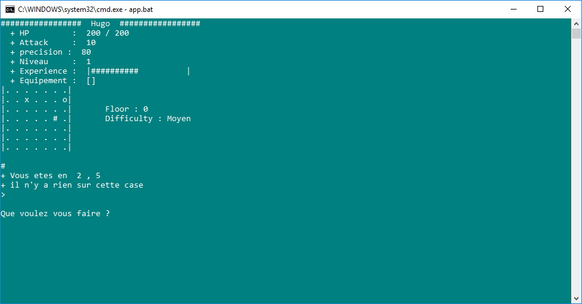

# Adventure Game

## What is it ?

Adventure game is a quick small game in which you will have to explore a "cavern" / "cellar / "well" nobody really know. Legend sais that something really mysterious and powerful is waiting for you in the depths. You will have lot of surprises, objects to find, and monster to kill to explore this place, but hopefully the reward is worth it.

## What does it look like ?



## How can I play ?

Download the repo, make sure python is installed on your computer (command `py` will be recognized if it is installed) and that's all !

Just double click on app.bat ! Of course you could easily change some code properties, but as **Gandhi** said :
> “C'est dans l'effort que l'on trouve la satisfaction et non dans la réussite. Un plein effort est une pleine victoire.”

Then the commands are pretty simples, basically juste n, s, e, w, for North South East West, and few more but you can display the help anytime if you're lost.
```
> HELP :
> Commands :
>     + n : North
>     + s : South
>     + e : East
>     + w : West
>     + d : Down
>     + t : Take
>     + h : Help
>     + u : use
>     + f : fight
>     + r : run
> Map :
>     + . : Nothing
>     + o : Hole
>     + # : Object
>     + ~ : Usable
>     + @ : Ennemy
> Objects :
>     + Torche        : la salle s'eclaire (LIGT +1)
>     + Fireball      : Une explosion de lumiere ! (LIGT +3)
>     + Epe en bois   : Petite epe en bois, plus efficace sur scene qu'en combat (ATK +5)
>     + Epe en fer    : Une epe digne des plus grands forgerons (ATK +15)
>     + Epe du demon  : La legende dit qu'elle est faite depuis la queue du demon... (ATK +50)
>     + Anneau        : Un etrange anneau (???)
>     + Amulette      : Une etrange amulette (???)
>     + Petite Armure : Une legere armure en cuire, elle vous sauvera des plus petits ennemis (HP +10)
>     + Grosse Armure : Une belle armure de chevalier (HP +25)
>     + Bouclier      : Un authentique ecusson de chevalier (HP +20)
>     + Masque        : Vous faites peur aux ennemis, ils vous attaquent de plus loin (AGRO +1)
```
